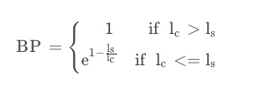

# BLEU和Rouge简介
##  几个名词
- N-gram是指“N元语法”，用来指文本中连续出现的N个词，是统计语言模型中的一种工具。
 - Precision：精确率:分子是机器摘要和标准摘要共现的单词个数，分母是机器摘要中单词的个数
 - Recall：召回率:分母是人工摘要（也就是标准摘要）中n-gram的个数，分子是人工摘要和机器生成的自动摘要共现（重合）的n-gram的个数。

 
举例说明(1-gram)：


##  BLEU 
[机器翻译评价指标之BLEU详细计算过程](https://blog.csdn.net/guolindonggld/article/details/56966200)

[实践答疑｜如何计算BLEU值？](https://www.163.com/dy/article/HICUO0TT0553237G.html)

[BLEU算法（例子和公式解释）](https://blog.csdn.net/qq_30232405/article/details/104219396)

[机器翻译评价指标 — BLEU算法](https://www.cnblogs.com/jiangxinyang/p/10523585.html)

- Modified n-gram Precision计算


- Brevity Penalty计算,惩罚因子


- BLEU计算

BLEU-4：表示公式中权值(W)均分， 都为1/4

```
from nltk.translate.bleu_score import sentence_bleu
# https://machinelearningmastery.com/calculate-bleu-score-for-text-python/

  
# https://blog.csdn.net/guolindonggld/article/details/56966200  机器翻译评价指标之BLEU详细计算过程
# https://www.163.com/dy/article/HICUO0TT0553237G.html 实践答疑｜如何计算BLEU值？

def get_scores(reference,translation):
    references = reference.split()
    translation = translation.split()

    
    # print(references)
    # print(translation)


    score_1=sentence_bleu([references], translation, weights=(1, 0, 0, 0))
    score_2=sentence_bleu([references], translation, weights=(0.5, 0.5, 0, 0))
    score_3= sentence_bleu([references], translation, weights=(0.33, 0.33, 0.33, 0))
    score_4 = sentence_bleu([references], translation, weights=(0.25, 0.25, 0.25, 0.25))

    return [score_1, score_2, score_3, score_4]
```
## rouge
[自动文摘评测方法：Rouge-1、Rouge-2、Rouge-L、Rouge-S](https://blog.csdn.net/mch2869253130/article/details/89810974)
```
# https://github.com/pltrdy/rouge

from rouge import Rouge 
# r: recall
# p:Precision
# f:F-Measure
# https://blog.csdn.net/mch2869253130/article/details/89810974

# [{'rouge-1': {'r': 0.42857142857142855, 'p': 0.5833333333333334, 'f': 0.49411764217577864}, 'rouge-2': {'r': 0.18571428571428572, 'p': 0.3170731707317073, 'f': 0.23423422957552154}, 'rouge-l': {'r': 0.3877551020408163, 'p': 0.5277777777777778, 'f': 0.44705881864636676}}]

# 召回率：分母是人工摘要（也就是标准摘要）中n-gram的个数，分子是人工摘要和机器生成的自动摘要共现（重合）的n-gram的个数。可以看出，ROUGE与召回率的定义很相似。
# 精确测量：分子是机器摘要和标准摘要共现的单词个数，分母是机器摘要中单词的个数。


def get_scores(reference,translation):
    rouge = Rouge()
    scores = rouge.get_scores(translation, reference)

    # print(scores)
    return scores
```
如果您的摘要在某种程度上可以通过某些约束来使摘要简洁或者是对精确度要求不高，那么您可以考虑仅使用Recall。其实现在的摘要评测任务一般只考虑**recall**。

Rouge-1:表示1-gram
Rouge-2:表示2-gram
Rouge-L:L即是LCS(longest common subsequence，最长公共子序列)的首字母，因为Rouge-L使用了最长公共子序列。计算方式：


